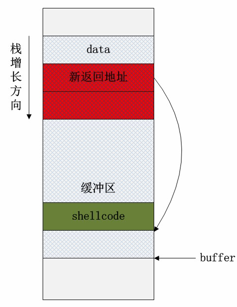
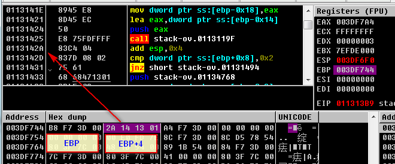

了解下缓存区溢出，在xp在还是比较容易实现的，之后的操作系统中。微软抹掉了系统dll中的了jmp esp，导致shellcode无法硬解码,也就无法运行了。需要通过其它高级技法去实现，略。

为什么是jmp esp，应为esp指向栈顶。shellcode放在这里，相当于函数的地址。作用shellcode的重要跳板。

----

这编文章写得很清楚，下面的文字直接引用了。

http://www.cnblogs.com/fanzhidongyzby/archive/2013/08/10/3250405.html


```c
push ebp        // 保存寄存器
mov ebp,esp
sub esp,0x8		
add esp,-0xC	// 栈大小为0xC
push 0x1
mov __set_app_type
call eax
```

```c
mov edi,edi
push ebp		// 保存寄存器
mov ebp,esp
push dword ptr ss:[ebp+0x8]
call msvcrt.758F1585
pop ecx
mov dword ptr ds:[0x75980030],eax
pop ebp
retn
```


-------------

由于栈是低地址方向增长的，因此局部数组buffer的指针在缓冲区的下方。当把data的数据拷贝到buffer内时，超过缓冲区区域的高地址部分数据会“淹没”原本的其他栈帧数据，根据淹没数据的内容不同，可能会有产生以下情况：

1、淹没了其他的局部变量。如果被淹没的局部变量是条件变量，那么可能会改变函数原本的执行流程。这种方式可以用于破解简单的软件验证。

2、淹没了ebp的值。修改了函数执行结束后要恢复的栈指针，将会导致栈帧失去平衡。

3、淹没了返回地址。这是栈溢出原理的核心所在，通过淹没的方式修改函数的返回地址，使程序代码执行“意外”的流程！

4、淹没参数变量。修改函数的参数变量也可能改变当前函数的执行结果和流程。

5、淹没上级函数的栈帧，情况与上述4点类似，只不过影响的是上级函数的执行。当然这里的前提是保证函数能正常返回，即函数地址不能被随意修改（这可能很麻烦！）。
如果在data本身的数据内就保存了一系列的指令的二进制代码，一旦栈溢出修改了函数的返回地址，并将该地址指向这段二进制代码的其实位置，那么就完成了基本的溢出攻击行为。




栈溢出攻击

上述过程虽然理论上能完成栈溢出攻击行为，但是实际上很难实现。操作系统每次加载可执行文件到进程空间的位置都是无法预测的，因此栈的位置实际是不固定的，通过硬编码覆盖新返回地址的方式并不可靠。为了能准确定位shellcode的地址，需要借助一些额外的操作，其中最经典的是借助跳板的栈溢出方式。

---

### 经典例子分析
```c
void RunAnyShellCode(unsigned char* shellcode)
{
	int buf[2];
	buf[3]=(int)(void*)shellcode;
}
```

对应的汇编代码
```c
00DD13B0 55               push        ebp  
00DD13B1 8B EC            mov         ebp,esp 
00DD13B3 83 EC 48         sub         esp,48h 
00DD13B6 53               push        ebx  
00DD13B7 56               push        esi  
00DD13B8 57               push        edi  
	int buf[2];
	buf[3]=(int)(void*)shellcode;
00DD13B9 8B 45 08         mov         eax,dword ptr [shellcode] 
00DD13BC 89 45 04         mov         dword ptr [ebp+4],eax 
}
00DD13BF 5F               pop         edi  
InitData:
00DD13C0 5E               pop         esi  
00DD13C1 5B               pop         ebx  
00DD13C2 8B E5            mov         esp,ebp 
00DD13C4 5D               pop         ebp  
00DD13C5 C3               ret  
```

执行到

00DD13C5 C3               ret 

返回到 shellcode
```c
0036FA80 B8 A4 11 3E 00   mov         eax,3E11A4h 
0036FA85 FF D0            call        eax  
```

针对上面的例子，执行
```c
00DD13BC 89 45 04         mov         dword ptr [ebp+4],eax 
```
后，可以看到[ebp+4]的值修改为shellcode的地址，
而这里的[ebp+4]保存了进入call时的下一条语句地址，也就是ret返回的地方。





